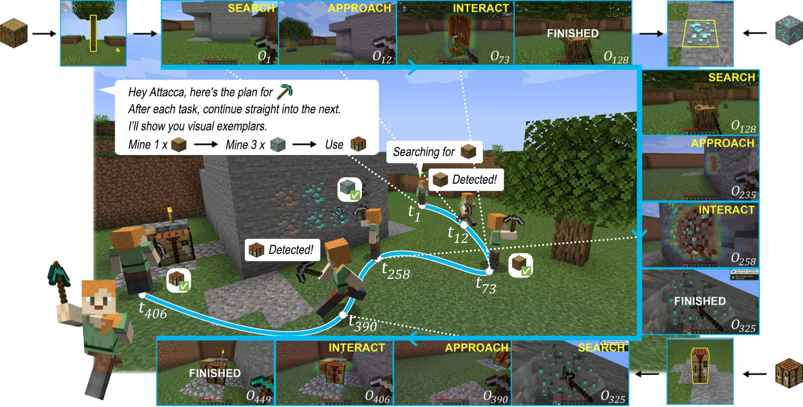
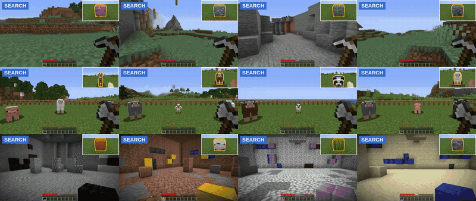

<div align="center">

# Attacca

### Goal-Directed Control under State Continuity for Long-Horizon Embodied Agents

Gyusik Seo · [Jaehong Yoon](https://jaehong31.github.io/)<br>
Nanyang Technological University

[](https://attacca-project.github.io/)
[](https://arxiv.org/abs/2610.07785)
[](https://huggingface.co/papers/2610.07785)
[](#citation)

</div>

<p align="center"></p>

Attacca is a goal-conditioned Minecraft policy that keeps working when one task ends and the next begins. Given a goal image and target mask taken in another world, it searches for the target, approaches it and interacts with it, starting from wherever the previous task left the agent.

<p align="center"></p>

## Installation

Linux, Python 3.10, Java 8 and an NVIDIA GPU. See [docs/installation.md](docs/installation.md) for details.

```bash
git clone https://github.com/attacca-project/attacca.git && cd attacca
conda create -n minestudio -c conda-forge python=3.10 openjdk=8 && conda activate minestudio
pip install torch==2.8.0 torchvision==0.23.0 --index-url https://download.pytorch.org/whl/cu128
git clone https://github.com/CraftJarvis/MineStudio.git ../MineStudio
git -C ../MineStudio checkout 278aa8553668d591339dbf30d281594ed06ee882
git -C ../MineStudio apply "$PWD/patches/minestudio.patch"
pip install -e ../MineStudio -e .
```

## Model and data

| | Hugging Face | Contents |
|---|---|---|
| Attacca model | [willsuh/attacca](https://huggingface.co/willsuh/attacca) | `config.json`, `model.safetensors` (758 MB) |
| Evaluation assets | [willsuh/attacca-dataset](https://huggingface.co/datasets/willsuh/attacca-dataset) | `attacca_eval_assets_release_v1.tar` (1.4 GB) |
| Training data | [willsuh/attacca-dataset](https://huggingface.co/datasets/willsuh/attacca-dataset) | `attacca_dataset_release_v1/` (21.4 GB, 1,160 demonstrations) |

## Evaluation

```bash
hf download willsuh/attacca --local-dir checkpoints/attacca
hf download willsuh/attacca-dataset attacca_eval_assets_release_v1.tar --repo-type dataset --local-dir .
tar -xf attacca_eval_assets_release_v1.tar

# Mine, Hunt and Place
MINESTUDIO_GPU_RENDER=0 python eval.py --task short --checkpoint checkpoints/attacca \
  --asset-root attacca_eval_assets_release_v1 --output-dir results/short --workers 1
# Diamond Pickaxe, Wolf Feeding and Nether Portal
MINESTUDIO_GPU_RENDER=0 xvfb-run -a python eval.py --task chains --checkpoint checkpoints/attacca \
  --output-dir results/chains --workers 1
```

Single tasks are selected with `--task mine`, `hunt`, `place`, `dpx` (Diamond Pickaxe), `ccfw` (Wolf Feeding) or `wlo` (Nether Portal). See [docs/evaluation.md](docs/evaluation.md).

## Training

```bash
hf download willsuh/attacca-dataset --repo-type dataset --include "attacca_dataset_release_v1/*" --local-dir .
python train.py --data-root attacca_dataset_release_v1 --output-dir runs/attacca
```

The recipe is [`configs/attacca.yaml`](configs/attacca.yaml) and uses three GPUs (change with `--devices`). See [docs/data.md](docs/data.md) for the data layout.

## Citation

```bibtex
@article{seo2026attacca,
  title   = {Attacca: Goal-Directed Control under State Continuity for Long-Horizon Embodied Agents},
  author  = {Seo, Gyusik and Yoon, Jaehong},
  journal = {arXiv preprint arXiv:2610.07785},
  year    = {2026}
}
```

## License and acknowledgements

Attacca builds on [MineStudio](https://github.com/CraftJarvis/MineStudio) and [ROCKET-2](https://github.com/CraftJarvis/ROCKET-2). Original Attacca code is released under the [MIT License](LICENSE). ROCKET-2-derived files and other third-party material are listed in [THIRD_PARTY_NOTICES.md](THIRD_PARTY_NOTICES.md).
